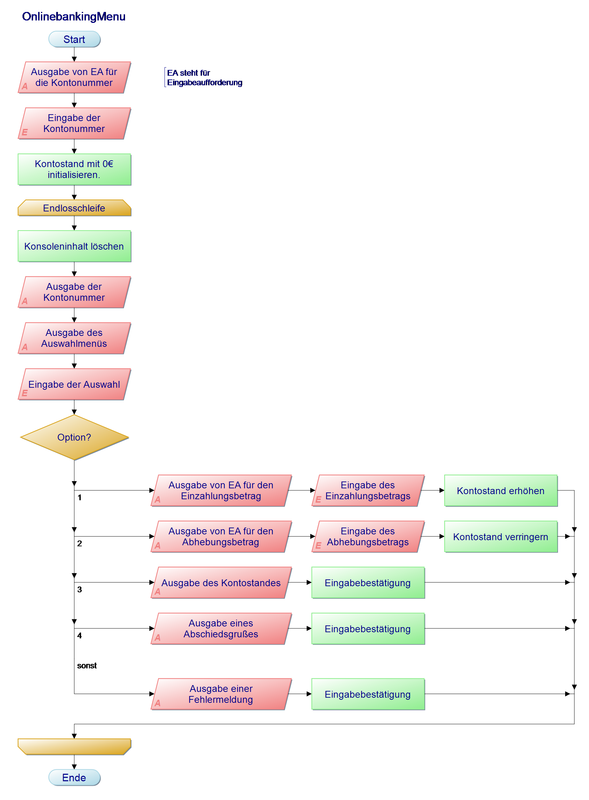
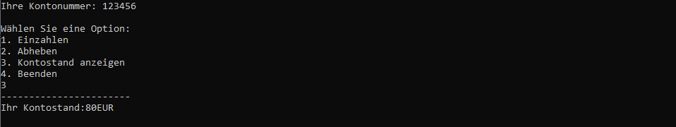
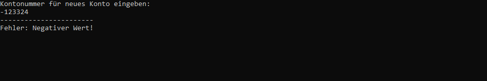

<div id="container" style="white-space:nowrap">

  <div id="image" style="display:inline float: right;">
        
  </div>

  <div id="texts" style="display:inline; white-space:nowrap; float: right;"> 
        <h1>Online-Banking-App SparBank AG</h1>
</div>


## :dart: Hauptauftrag 
Sie haben den Auftrag erhalten, eine Konsolenanwendung für ein Online-Banking-System zu entwerfen, welche die Daten eines Kunden verarbeiten kann. Der Kunde möchte die Software anschließend in sein bereits vorhandenes Finanzsystem einbinden. Dieses Repository hat Herr Schneider für Sie aufgesetzt und die Anforderungen des Auftraggebers ausformuliert.

### Anforderungen
  
Der Benutzer wählt in einem Menü zwischen den Punkten

1. Geld einzahlen
2. Geld abheben
3. Kontostand
4. Programm beenden

Das Programm verarbeitet immer jeweils ein Kundenkonto.
  
**Rahmendbedingungen**

|Framework Anforderungen | Anforderungen an die Benutzerfreundlichkeit| Externe Anforderungen|
|----------|----------|----------|
|Programmiert in C#|Programm und einzelne Optionen sind beliebig oft wiederholbar.|Alle gesetzlichen vorgaben werden eingehalten.|
|Konsolenanwendung|Eine Fehleingabe führt zu einer erneuten Eingabeaufforderung.|Moralische und ethische Grundsätze sind einzuhalten.|
|.NET 6 |Alle eingaben werden über die Tastatur gemacht.|-|
|-|Die Konsole wird beim Verlassen des aktuellen Moduls gelöscht.|-|
|-|Das Programm wird auf Befehl beendet.|-|

  
  
## :bookmark_tabs: Informationsquelle   
Das Informationsmaterial zur Aufgabe finden Sie [hier](https://github.com/GSO-SW/public_content_gso/tree/main/EducationMaterials/Csharp)   
Informationen zur Objektorientierung finden Sie [hier](https://github.com/GSO-SW/public_content_gso/wiki/Objektorientierung)

---

### Aufgabe 1: Online-Banking-App Grundgerüst implementieren

Um Ihnen den Einstieg zu erleichtern, hat Herr Schneider einen ersten Entwurf erstellt. Der Programmablaufplan zeigt zeigt das Menü der Inline-Banking-App und ermöglicht bereits das Einzahlen unf Abheben von Beträgen.


  
**a)** Implementieren sie das von Herr Schneider entworfene Program.
  
> :information_source: **Hinweise**:exclamation:
> + Beachten Sie, dass Sie die Ausgabe unter der gestrichelten Linie erzeugen müssen, um die Aufgabe zu bestehen.
> + Da in der Testumgebung keine Konsole geöffnet ist, führt der Befehl ```Console.Clear()``` zu einem Fehler. Verwenden Sie den Befehl deshalb unter der Bedingung das nicht getestes wird. ```if (Environment.GetEnvironmentVariable("IsTesting") != "true") Console.Clear(); ```.
> + Der Befehl ```Console.ReadKey()``` kann in der Testumgebung nicht verarbeitet werden. Nutzen Sie stattdessen ```Console.ReadLine()```.
Beispiel Ausgabe/Ergebnis:

     

---
  
### Aufgabe 2: Online-Banking-App Bankkonto als Klass

Nutzen Sie die Implementierung aus Aufgabe 1 um das Programm zu erweitern.   
Das Bankkonto soll in Form einer Klasse (mit dem Namen **Bankkonto**) realisiert werden. Diese Klasse wird die Basis für die weitere Verwaltung von Bankkonten in der Anwendung sein.
Die Klasse soll die folgenden Felder enthalten:

- Kontonummer
- Kontostand

**a)** Implementieren Sie das Program.
  
> :information_source: **Hinweise**:exclamation:
> + Beachten Sie, dass sich die Funktionalität von Aufgabe 1 erhalten bleibt.
> + Nutzen Sie ggf. die [Informationen](https://github.com/GSO-SW/public_content_gso/wiki/Objektorientierung#hauptkonzepte) aus dem Wiki.


Beispiel Ausgabe/Ergebnis:


  
---

### Aufgabe 3: Online-Banking-App Felder anpassen

Nutzen Sie die Implementierung aus Aufgabe 2 um das Programm zu erweitern.   
Passen Sie das Feld Kontonummer so an, dass nur positive Integerwerte gesetzt werden können. Bei negativen Werten soll eine Fehlermeldung in der Konsole ausgegeben werden.

**a)** Implementieren Sie das Program.
  
> :information_source: **Hinweise**:exclamation:
> + Beachten Sie, dass Sie die Ausgabe unter der gestrichelten Linie erzeugen müssen, um die Aufgabe zu bestehen.
> + Nutzen Sie ggf. die [Informationen](https://github.com/GSO-SW/public_content_gso/wiki/Objektorientierung#datenkapselung-mit-eigenschaftsmethoden-in-c) aus dem Wiki.


Beispiel Ausgabe/Ergebnis:

  
---

### Aufgabe 4: Online-Banking-App Methoden

Nutzen Sie die Implementierung aus Aufgabe 3 um das Programm zu erweitern. Definieren Sie in der Klasse **'Bankkonto'** die folgenden drei Methoden:

**Klasse:** Bankkonto   
    **Felder:**   
    + kontonummer: int   
    + kontostand: double = 0   
    **Methoden:**   
    + Einzahlung(einzahlungsbetrag: double): void   
    + Auszahlung(abhebebetrag: double): void   
    + Kontostand(): void   


**a)** Realisieren Sie die Methoden in der Klasse **'Bankkonto'** und Beachten Sie dabei die übergebenen Datentypen.

> :information_source: **Hinweise**:exclamation:
> + Beachten Sie, dass Sie die Ausgabe unter der gestrichelten Linie erzeugen müssen, um die Aufgabe zu bestehen.
> + Sie müssen das Dateiformat und die Namensgebung einhalten damit das Struktogramm Ihnen hier angezeigt wird.

---

### Aufgabe 5: Online-Banking-App mehrere Konten

Nutzen Sie die Implementierung aus Aufgabe 4 um das Programm zu erweitern.   
In dieser Aufgabe sollen Sie eine Banking-App entwickeln, die mehrere Bankkonten verwaltet. Die App soll um folgende Optionen ergänzt werden:

* Konto erstellen
* Konto auswählen

**a)** Implementieren Sie das Program.
  
> :information_source: **Hinweise**:exclamation:
> + Beachten Sie, dass der Test die Klasse mit ihren genauen Bezeichnungen aufruft.
> + Um die verschiedenen Konten abzuspeichern, können Sie generische Listen verwenden [(Information.)](https://github.com/GSO-SW/public_content_gso/wiki/Objektorientierung#datenkapselung-mit-eigenschaftsmethoden-in-c) 

  
---
  
### Aufgabe 6: Arbeit einreichen

1. In Visual Studio 2022 das Fenster "Git-Änderungen" aufrufen
2. Eine kurze Beschreibung Ihrer Änderungen in die Textbox eingeben und "commit für alle" klicken
3. Mit dem Pfeil nach oben die Arbeit auf GitHub pushen.
4. Das Repository im Brower aufrufen und aktualisieren um die Änderungen zu bestätigen.
5. Im Pull-Request die Nachricht "Bereit zum Bewerten" hinterlassen, damit Ihre Lehrkraft weiss das Sie fertig sind.

---
  
# :100: Erfolgskriterien
  
+ Eingesetzten Quellcode kommentieren
+ Quellcode schreiben der lesbar ist und mit Hilfe einer logischen Folge das Problem löst
+ Programmausgabe die korrekt, lesbar und richtig formatiert ist 
