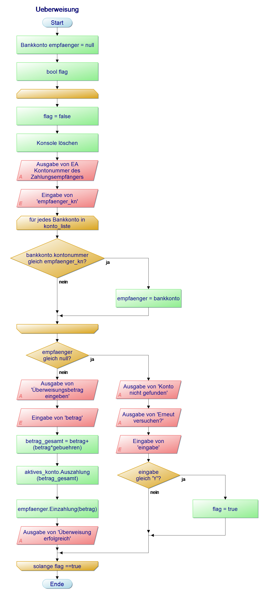

<div id="container" style="white-space:nowrap">

  <div id="image" style="display:inline float: right;">
        
  </div>

  <div id="texts" style="display:inline; white-space:nowrap; float: right;"> 
        <h1>Online-Banking-App Erweiterung</h1>
</div>


## :dart: Hauptauftrag 
Sie haben den Auftrag erhalten die von Ihnen erstellte Online-Banking-App zu erweitern. Die erwarteten Erweiterungen würden in folgendem UML-Klassendiagramm dokumentiert.


  
## :bookmark_tabs: Informationsquelle   
Das Informationsmaterial zur Aufgabe finden Sie [hier](https://github.com/GSO-SW/public_content_gso/tree/main/EducationMaterials/Csharp)   
Informationen zur Objektorientierung finden Sie [hier](https://github.com/GSO-SW/public_content_gso/wiki/Objektorientierung)

---

### Aufgabe 1: Überweisungen ermöglichen

Der bisherige Quellcode ist [hier](./Aufgabe1_Ueberweisung/Program.cs) hinterlegt. Sie sollen in diesem Schritt eine Überweisungsfunktion implementieren. Die folgende Checkliste soll Sie dabei Unterstützen. 

1. Ein privates **'gebuehren'** feld in der Klasse **'Bank'** anlegen und mit **'0.01'**(1%) initialisieren.
2. Den Menüpunkt **'6. Überweisen'** im Bankmenü hinzufügen.
3. Den **'case "6":'** umwandeln und den Aufruf der Methode **'Ueberweisung();'** aufrufen.
4. Erstellen Sie die Überweisungmethode. Folgende PAP soll sie dabei Unterstützen.



> :information_source: **Hinweise**:exclamation:
> + Beachten Sie, dass sich die Funktionalität des Boilerplate-Codes erhalten bleibt.
> + Nutzen Sie ggf. die [Informationen](https://github.com/GSO-SW/public_content_gso/wiki/Objektorientierung#hauptkonzepte) aus dem Wiki.

---
  
### Aufgabe 2: Dispositionsfunktion

Kopieren Sie die Implementierung aus Aufgabe1 in die [Aufgabe2](./Aufgabe2_DispoEinrichten/Program.cs) In diesem Schritt wird dem Bankkunden die Option gegeben, eine Disposition für ihr Konto einzurichten. Um dies zu erreichen, arbeiten Sie folgende Punkte ab: 

1. Ein öffentliches **'dispo'** feld in der Klasse **'Bankkonto'** anlegen und mit **'0'** initialisieren.
2. Den Menüpunkt **'7. Dispo Einrichten'** im Bankmenü hinzufügen.
3. Den **'case "7":'** umwandeln und den Aufruf der Methode **'DispoEinrichten();'** aufrufen.
4. Erstellen Sie die private Dispositionsmethode.
5. In der Dispositionsmethode fragen Sie den Nutzer nach seinem gewünschten Dispo und passen den **'dispo'**-Wert des aktiven Kontos an.

**Auszahlung anpassen**
1. Lassen Sie die Auszahlungsmethode der Bankkonten einen boolischen Wert zurückgeben. **'true'** wenn der Verfügungsrahmen ausreicht und **'false'** wenn das Geld für die Auszahlung oder überweisung nicht ausreicht.
2. Reicht das Geld nicht aus, wird eine Meldung ausgegeben.
3. Überweisen Sie in der Methode **'Uberweisung'** nur, wenn die Auszahlung **'true'** zurück gibt.

  
> :information_source: **Hinweise**:exclamation:
> + Beachten Sie, dass sich die Funktionalität von Aufgabe 1 erhalten bleibt.
> + Nutzen Sie ggf. die [Informationen](https://github.com/GSO-SW/public_content_gso/wiki/Objektorientierung#hauptkonzepte) aus dem Wiki.
  
---

### Aufgabe 3: Transaktionshistorie

Nutzen Sie die Implementierung aus Aufgabe 2 um das Programm zu erweitern.   
Damit die Kunden nachschauen können, welche Ein- und Auszahlungen getätigt wurden, wird eine Transaktionshistorie erstellt.
Um diese zu realisieren, arbeiten Sie folgende Punkte ab: 

1. Ein öffentliches **'transaktionen'** feld in der Klasse **'Bankkonto'** anlegen ``public List<string> transaktionen = new List<string>();``.
2. Gehen Sie zur Methode **'Ueberweisungen'** und verändern Sie die Transaktionslisten des emfänger- und aktives-Konto wenn eine Transaktion möglich ist. nutzen Sie folgende formulierungen:
   ```aktives_konto.transaktionen.Add($"{"Auszahlung",15}{"Kontonummer:"}{"-"+betrag_gesamt+"EUR",15}");```
   ```empfaenger.transaktionen.Add($"{"Einzahlung",15}{"Kontonummer:"}{"+" + betrag + "EUR",15}");");```
   
4. Erstellen Sie die öffentliche Methode **'TransaktionenAnzeigen'** in der **'Bankkonto'** Klasse. Diese Methode soll alle Transaktionen anzeigen.

  
> :information_source: **Hinweise**:exclamation:
> > + Beachten Sie, dass sich die Funktionalität von Aufgabe 2 erhalten bleibt.
> + Nutzen Sie ggf. die [Informationen](https://github.com/GSO-SW/public_content_gso/wiki/Objektorientierung#datenkapselung-mit-eigenschaftsmethoden-in-c) aus dem Wiki.

  
---

### Aufgabe 4: Aufgabe abgeben

1. In Visual Studio 2022 das Fenster "Git-Änderungen" aufrufen
2. Eine kurze Beschreibung Ihrer Änderungen in die Textbox eingeben und "commit für alle" klicken
3. Mit dem Pfeil nach oben die Arbeit auf GitHub pushen.
4. Das Repository im Brower aufrufen und aktualisieren um die Änderungen zu bestätigen.
5. Im Pull-Request die Nachricht "Bereit zum Bewerten" hinterlassen, damit Ihre Lehrkraft weiss das Sie fertig sind.

---
  
# :100: Erfolgskriterien
  
+ Eingesetzten Quellcode kommentieren
+ Quellcode schreiben der lesbar ist und mit Hilfe einer logischen Folge das Problem löst
+ Programmausgabe die korrekt, lesbar und richtig formatiert ist 
